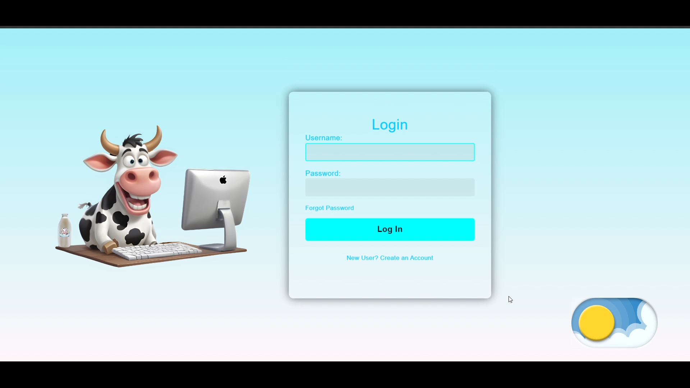
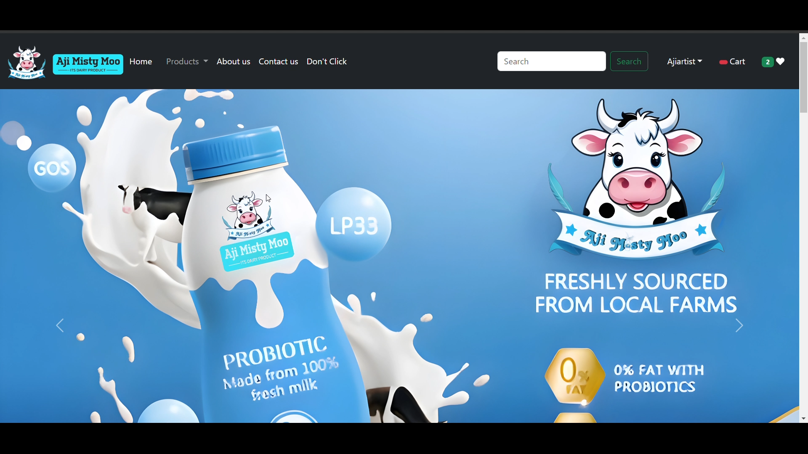
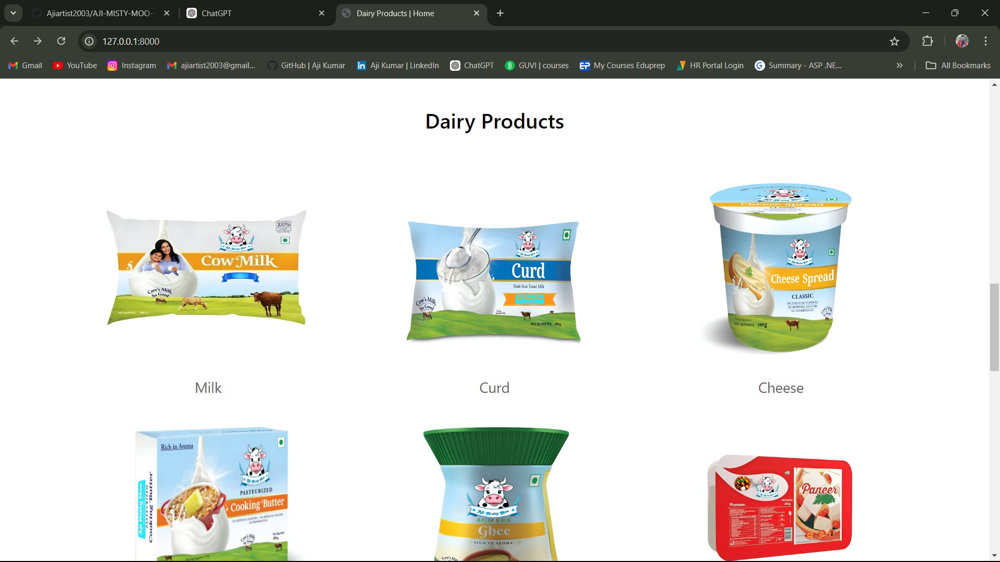
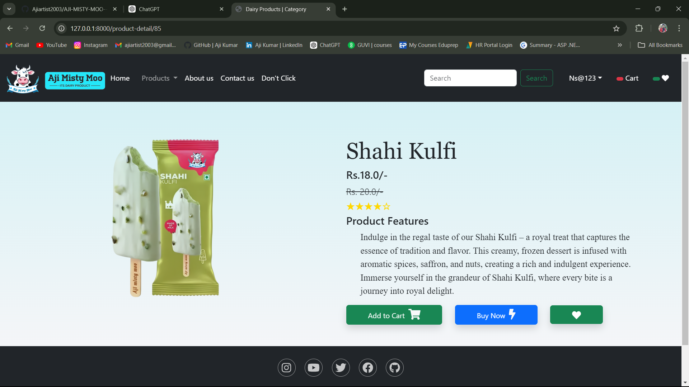
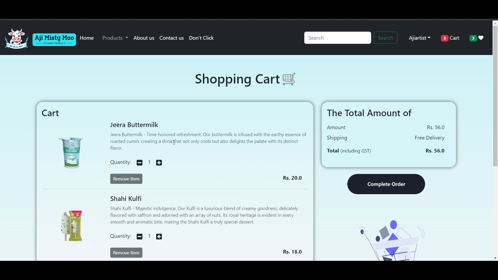
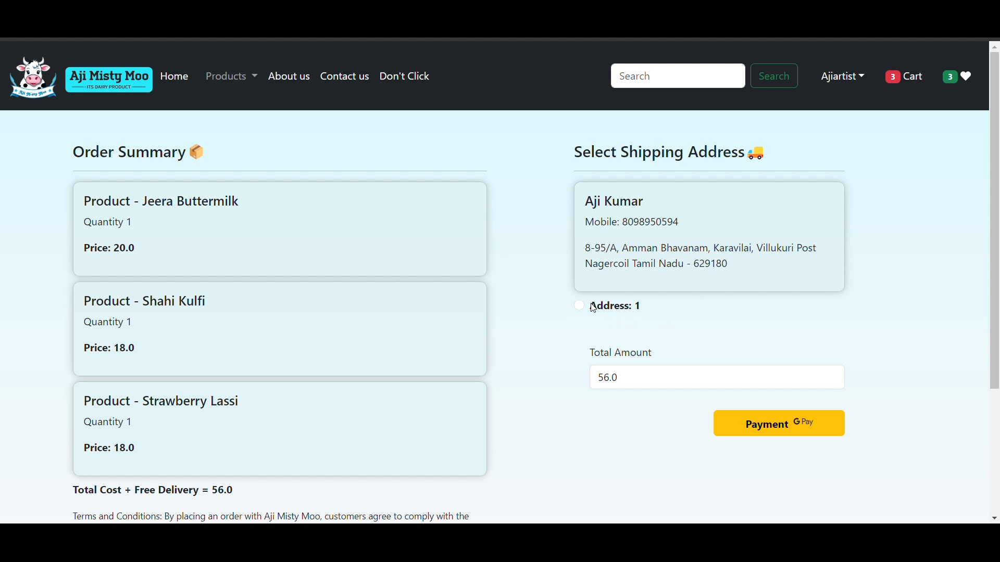
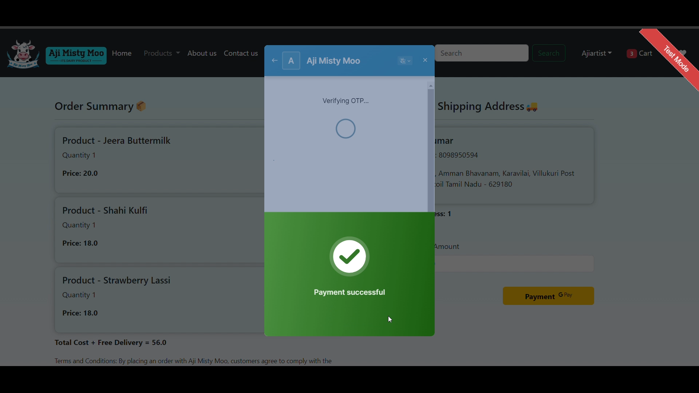
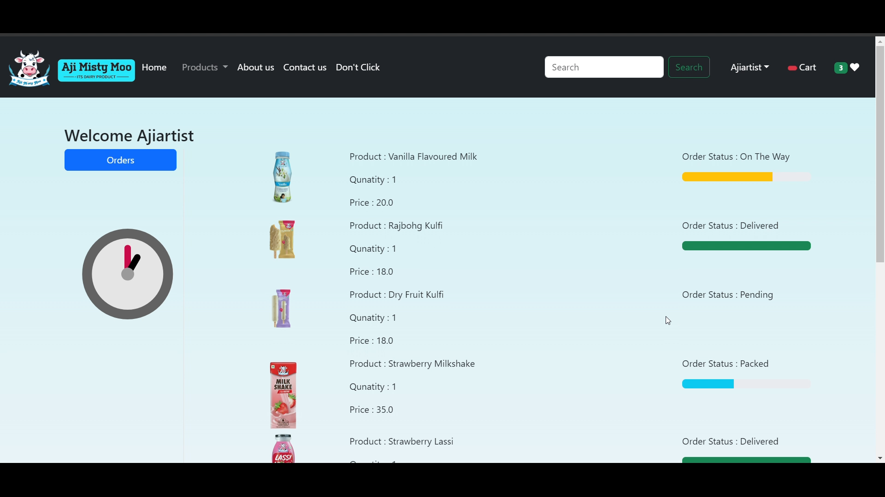
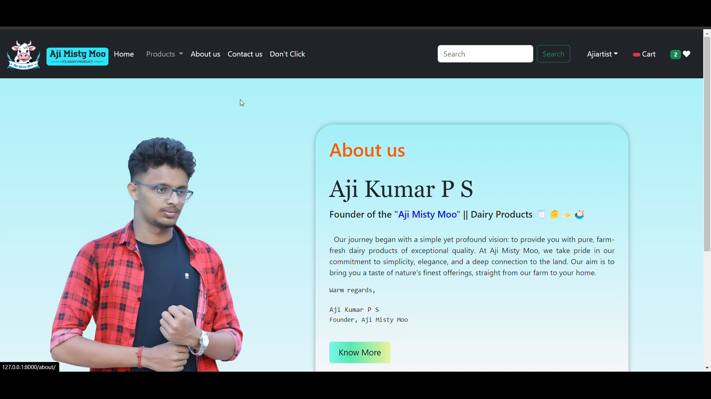
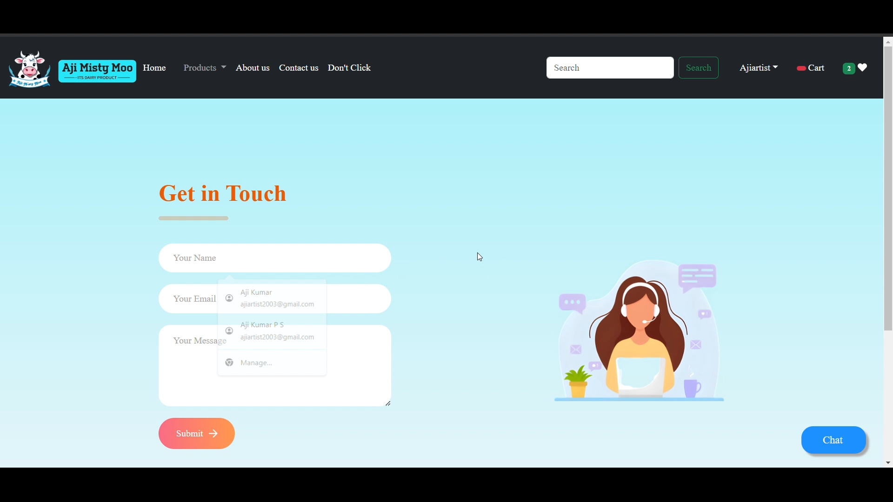

# AJI MISTY MOO - DAIRY PRODUCTS

#### Aji Misty Moo emerges as a distinctive online platform dedicated to the sale of premium-quality dairy products. This innovative website is meticulously crafted using a stack of web technologies, including HTML, CSS, JavaScript, jQuery, Bootstrap, Python, and Django, to provide users with a seamless and visually appealing shopping experience.Integration of Razorpay, a secure online payment gateway, facilitates seamless and secure transactions. 

## Technologies Used
- Frontend: HTML, CSS,JavaScript,JQuery, Bootstrap
- Backend: Python-Django
- Database: Sqlite3
- IDE: Visual Studio Code 2021

## Screenshots
### Login Page 

### Home Page 

### Products Page 

### Buy Now Page 

### Add to Cart Page 

### Payment Page 

### Razorpay Page 

### Orders Page 

### About Us Page 

### Contact Us Page 

